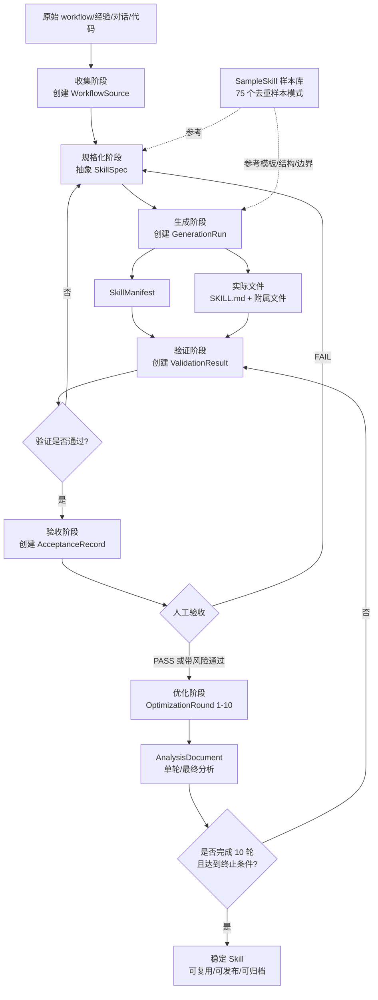

# SkillForge MVP 端到端流程

> SkillForge 的目标是把 workflow、经验、对话和代码中的可复用做法，转化为可运行、可验收、可持续优化的 AI skill。本文定义 MVP 的端到端产品流程，承接 `docs/data-structure.md` 的实体设计，并吸收 `docs/sample-skill-library.md` 对 75 个真实 skill 样本的分析结论。

## 1. 流程总览

### 1.1 核心链路

```text
原始材料
  ├─ workflow 文档
  ├─ 经验总结
  ├─ 对话记录
  └─ 代码/脚本/项目规则
      │
      ▼
[收集阶段] WorkflowSource
      │  提取事实、上下文、边界、来源
      ▼
[规格化阶段] SkillSpec
      │  抽象目标、触发场景、输入输出、约束、权限、成功标准
      ▼
[生成阶段] GenerationRun
      │  参考 SampleSkill 样本库，生成 SkillManifest 与文件
      ▼
SkillManifest + skill 文件
      │  典型产物：SKILL.md + tools/references/scripts/assets/examples 等附属文件
      ▼
[验证阶段] ValidationResult
      │  结构/触发/边界/依赖/回放/去隐私/兼容 7 维检查
      ▼
[验收阶段] AcceptanceRecord
      │  人工确认 PASS / FAIL / ACCEPT_WITH_RISKS
      ▼
[优化阶段] OptimizationRound × 10
      │  每轮分析优缺点，保留优势，修正缺陷，重新验证
      ▼
AnalysisDocument
      │
      ▼
可复用、可发布、可持续演进的 AI skill
```

### 1.2 Mermaid 流程图



### 1.3 阶段责任边界

| 阶段 | 主要问题 | 核心产物 | 通过标志 |
|---|---|---|---|
| 收集 | 原始经验是什么、来自哪里、是否能公开 | `WorkflowSource` | 原始材料和上下文足够还原意图 |
| 规格化 | 要生成什么 skill，何时触发，边界在哪里 | `SkillSpec` | 成功标准、输入输出、权限约束明确 |
| 生成 | 如何落成可运行 skill 文件 | `GenerationRun`、`SkillManifest`、文件 | 生成成功且产物路径完整 |
| 验证 | 产物是否结构正确、触发准确、安全可用 | `ValidationResult` | 7 维检查满足最低阈值 |
| 验收 | 是否符合用户/产品目标 | `AcceptanceRecord` | 人工确认 PASS 或带风险通过 |
| 优化 | 如何通过 10 轮迭代提高质量 | `OptimizationRound`、`AnalysisDocument` | 完成 10 轮或满足终止条件 |

## 2. 阶段定义

## 2.1 收集阶段：提取 WorkflowSource

### 目标

从 workflow、经验、对话和代码中提取可追踪的源材料，形成 `WorkflowSource`。这一阶段只做事实收集和最小整理，不急着生成 skill，避免把未确认的上下文误写进产物。

### 输入

- 手写 workflow：步骤、规则、检查清单、命令片段。
- 经验总结：成功案例、失败案例、踩坑记录、最佳实践。
- 对话记录：用户需求、协作过程、决策理由、反馈意见。
- 代码/脚本/配置：已有自动化流程、项目规则、工具调用方式。
- 背景信息：使用人、项目、语言、权限、隐私等级、适用范围。

### 处理动作

1. 识别来源类型：`manual`、`chat`、`doc`、`code`、`mixed`。
2. 提取核心内容：保留能复现 workflow 的步骤、判断条件、输入输出。
3. 提取上下文：业务目标、目标用户、项目环境、依赖工具。
4. 标注标签：如 `math`、`feishu`、`coding`、`mcp`、`automation`。
5. 做初步去隐私：公开产物不需要的 token、绝对路径、个人信息只保留摘要或占位符。
6. 记录维护人和时间戳，便于后续追踪。

### 输出

- `WorkflowSource`：包含 `id`、`title`、`sourceType`、`content`、`context`、`owner`、`tags`、`language`、`createdAt`、`updatedAt`。

### 人工确认点

- 原始 workflow 是否表达完整。
- 哪些内容可以进入公开 skill，哪些只能作为私有上下文。
- 经验是否具有复用价值，而不是一次性任务记录。
- 来源是否可靠，是否需要补充样例或背景。

### 失败回退策略

| 失败场景 | 回退动作 |
|---|---|
| 材料太散，无法归纳流程 | 回到收集阶段，要求补充 1-3 个成功案例和反例 |
| 对话中含敏感信息 | 先脱敏再入库；无法脱敏则仅保存摘要 |
| 代码依赖不清楚 | 标记 `sourceType=code` 或 `mixed`，补充工具/运行环境说明 |
| 目标不稳定 | 暂存为 `WorkflowSource`，不进入规格化 |

## 2.2 规格化阶段：WorkflowSource → SkillSpec

### 目标

将原始材料抽象成可生成、可验收的 skill 规格，即 `SkillSpec`。规格化阶段回答：这个 skill 解决什么问题、什么时候该触发、需要什么输入、输出什么结果、有哪些边界和权限。

### 输入

- `WorkflowSource`。
- 样本库中的结构模式：角色定位、Use when/触发词、工作流、工具边界、检查清单、输出规范。
- 产品约束：MVP 需要验收和 10 轮优化闭环。

### 处理动作

1. 定义目标：写清 `goal`，避免泛泛而谈。
2. 定义触发场景：抽取 `triggerScenarios`，同时列出反触发场景，防止误触发。
3. 定义输入输出：明确字段名、类型、必填性、说明。
4. 定义约束：隐私、权限、禁止事项、质量门槛、外部操作确认策略。
5. 定义成功标准：形成可检查的 `successCriteria`，后续用于 `AcceptanceRecord.criteriaResults`。
6. 选择状态：未确认时为 `draft`，可生成时为 `ready`。
7. 确认版本：MVP 初始建议 `0.1.0`，结构性变更升级版本。

### 输出

- `SkillSpec`：包含 `workflowSourceId`、`displayName`、`slug`、`goal`、`triggerScenarios`、`inputs`、`outputs`、`constraints`、`successCriteria`、`version`、`status`。

### 人工确认点

- 触发场景是否过宽或过窄。
- 输入输出是否符合真实使用方式。
- 权限边界是否明确，尤其是写文件、执行命令、网络/API、外发消息。
- 成功标准是否可验证，而不是主观描述。

### 失败回退策略

| 失败场景 | 回退动作 |
|---|---|
| 目标不清 | 回到收集阶段补充用户意图和典型任务 |
| 触发边界争议大 | 增加正例/反例；暂时保持 `draft` |
| 输入输出无法稳定 | 拆分为多个更小的 SkillSpec |
| 权限过高或不可审计 | 降级为只读流程，或要求人工确认策略写入约束 |

## 2.3 生成阶段：SkillSpec + 样本库 → SkillManifest + 文件

### 目标

基于 `SkillSpec` 和 `SampleSkill` 样本库，生成 `SkillManifest` 与实际 skill 文件。MVP 的默认入口是 `SKILL.md`，复杂 skill 可带附属文件。

### 输入

- `SkillSpec`：生成的唯一主规格。
- `SampleSkill[]`：按领域、结构复杂度、权限边界、文件形态筛选出的参考样本。
- 生成策略：单文件、带 references/tools、带 scripts/assets/examples 等。

### 样本库参与方式

`docs/sample-skill-library.md` 显示：去重后约 75 个独立 skill 中，所有样本都以目录级 `SKILL.md` 为入口；frontmatter 常见组合为 `name + description` 或 `name + version + description + metadata`；description 同时承担检索和触发职责；主体通常包含角色定位、触发条件、工作流、工具边界、约束、检查清单、输出规范。

因此生成阶段按以下方式使用样本库：

1. **选结构模板**：
   - 简单流程：生成单文件 `SKILL.md`。
   - 工具/API 型：生成 `SKILL.md` + `references/`。
   - 多步骤操作型：生成 `SKILL.md` + `tools/` 或 `examples/`。
   - 自动化/脚本型：生成 `SKILL.md` + `scripts/` + 依赖声明。
   - 复杂生成型：可参考 `assets/`、模板、`.clawhub/` 元数据，但 MVP 默认不复制运行产物和 `.learnings/`。
2. **借鉴 frontmatter**：最低包含 `name`、`description`；推荐包含 `version`、`metadata.openclaw`；发布型再考虑 `homepage`、`repository`、`license`、`tags`。
3. **借鉴触发表达**：中文使用“触发词：”；英文或通用描述使用 `Use when ... Examples: ...`，并补充反触发说明。
4. **借鉴正文体例**：角色定位 → 何时使用 → 工作流程 → 工具/权限边界 → 检查清单 → 输出规范 → 能力边界。
5. **借鉴安全边界**：涉及飞书、GitHub、Discord、邮件、浏览器、MCP、外部 API、文件写入时，必须写明确认策略和最小权限。
6. **避免样本风险**：不直接复制项目专属路径、token、真实业务规则、`.learnings/`、`output/`；同名重复样本降权，提炼模式而非照搬内容。

### 处理动作

1. 创建 `GenerationRun`，记录 `workflowSourceId`、`skillSpecId`、`sampleIds`、`generator`、`promptVersion`。
2. 选择参考样本：按 `domainTags`、`structureType`、`riskTags`、`reusabilityScore` 匹配。
3. 生成目录和文件：至少生成 `SKILL.md`；需要时生成 `tools/`、`references/`、`scripts/`、`assets/`、`examples/`。
4. 生成 `SkillManifest`：记录 `name`、`displayName`、`version`、`description`、`entry`、`files`、`dependencies`、`configSchema`、`compatibility`、`status`。
5. 记录产物摘要：`GenerationRun.artifacts` 保存路径、类型、校验和；`logs` 只保存关键摘要，不保存敏感原文。

### 输出

- `GenerationRun`：状态为 `succeeded` 或 `failed`。
- `SkillManifest`：初始状态 `generated`。
- 实际文件：`SKILL.md` + 可选附属文件。

### 人工确认点

- 生成的 description 是否准确承载触发意图。
- 文件数量是否和复杂度匹配，是否过度设计。
- 附属文件是否必要，脚本是否有依赖和副作用说明。
- 生成内容是否误带私密路径、账号、项目细节。

### 失败回退策略

| 失败场景 | 回退动作 |
|---|---|
| 生成失败 | `GenerationRun.status=failed`，记录 `error.recoverable`；修正 SkillSpec 后重试 |
| 文件结构不完整 | 回到生成阶段补齐 `SkillManifest.files` 和实际文件 |
| 触发描述偏离目标 | 回到规格化阶段调整 `triggerScenarios` 和 description |
| 产物包含敏感信息 | 中止验证，执行去隐私处理后重新生成 |

## 2.4 验证阶段：7 维检查

### 目标

对生成 skill 做自动和人工结合的质量检查，形成 `ValidationResult`。MVP 固定采用 7 维验证：结构、触发、边界、依赖、回放、去隐私、兼容。

### 输入

- `SkillManifest`。
- 实际文件目录。
- `GenerationRun`。
- `SkillSpec.successCriteria`。
- 正例/反例测试样本。

### 7 维验证定义

| 维度 | 检查内容 | 典型方法 |
|---|---|---|
| 结构验证 | 是否有入口 `SKILL.md`；frontmatter 至少含 `name`、`description`；资源路径存在 | 文件扫描、frontmatter 解析、manifest 对账 |
| 触发验证 | description 是否含明确 Use when/触发词；是否避免过宽泛误触发 | 正例/反例匹配、人工审查 |
| 边界验证 | 敏感外部操作是否写确认策略；写文件/网络/API 是否可审计 | 权限清单检查、风险标注 |
| 依赖验证 | 脚本、解释器、包、CLI、MCP、模板是否声明且路径可解析 | 依赖清单、可执行性检查 |
| 样本回放 | 用 2-3 个正例和 1-2 个反例检查选择与输出行为 | 回放测试、输出比对 |
| 去隐私验证 | 是否含绝对路径、token、个人信息、项目私密业务规则 | 关键词/模式扫描、人工复核 |
| 兼容验证 | 相对路径、OS 差异、OpenClaw 版本、模型假设是否说明 | 兼容矩阵检查 |

### 输出

- `ValidationResult`：包含 `method`、`testCases`、`checklist`、`score`、`passed`、`issues`、`validatedBy`、`validatedAt`。
- 如果通过，可将 `SkillManifest.status` 更新为 `validated`。

### 人工确认点

- 验证问题的严重级别是否合理。
- 是否允许带风险进入验收。
- 样本回放是否覆盖核心使用场景。
- 去隐私结果是否满足发布/复用要求。

### 失败回退策略

| 失败维度 | 回退动作 |
|---|---|
| 结构失败 | 回到生成阶段补齐文件和 manifest |
| 触发失败 | 回到规格化阶段重写触发场景和反触发 |
| 边界失败 | 回到规格化阶段收紧权限，再重新生成 |
| 依赖失败 | 补充依赖声明或移除不必要脚本 |
| 回放失败 | 补充示例、修正工作流步骤，重新验证 |
| 去隐私失败 | 立即脱敏并重新生成产物 |
| 兼容失败 | 改用相对路径、配置变量或替代命令 |

## 2.5 验收阶段：人工 PASS/FAIL

### 目标

由人或被授权的验收 agent 根据成功标准确认 skill 是否达到 MVP 可用标准，形成 `AcceptanceRecord`。验收不是再次写文档，而是做产品决策：接受、拒绝或带风险接受。

### 输入

- `SkillSpec.successCriteria`。
- 最近一次通过或部分通过的 `ValidationResult`。
- `SkillManifest` 和实际文件。
- 遗留风险清单。

### 处理动作

1. 将每条成功标准转成 `criteriaResults`。
2. 为每条标准记录证据：测试用例、文件路径、验证分数、人工观察。
3. 选择决策：`accept`、`reject`、`accept_with_risks`。
4. 若带风险接受，写明 `risks` 和 `requiredFollowUps`。
5. 更新 `SkillManifest.status`：通过后可进入 `accepted`；拒绝则回退到规格化或生成阶段。

### 输出

- `AcceptanceRecord`：包含 `accepted`、`criteriaResults`、`decision`、`risks`、`requiredFollowUps`、`acceptedBy`、`acceptedAt`。

### 人工确认点

- 是否真的满足“可复用”的产品目标。
- 风险是否可接受，是否影响发布范围。
- 是否进入 10 轮优化；MVP 默认验收后仍要继续优化，除非明确终止。

### 失败回退策略

| 验收结果 | 回退动作 |
|---|---|
| `reject` | 回到规格化阶段修正目标/标准，或回到生成阶段重做产物 |
| `accept_with_risks` | 进入优化阶段，但把风险写入前几轮优化目标 |
| 证据不足 | 回到验证阶段补充测试用例和检查结果 |
| 验收标准变化 | 更新 `SkillSpec.version`，重新生成和验证 |

## 2.6 优化阶段：10 轮迭代

### 目标

MVP 固定执行 10 轮优化。每轮都要分析当前 skill 的优点和缺点，明确保持/扩大优点的动作，以及改善缺点的动作；应用改动后重新验证，并产出分析文档。

### 进入条件

满足以下条件之一即可进入优化阶段：

1. 已有 `AcceptanceRecord.decision=accept`，需要进一步提升质量。
2. 已有 `AcceptanceRecord.decision=accept_with_risks`，需要用优化轮消化风险。
3. 验证结果未完全通过，但产物已足够成形，适合通过迭代修正。
4. 产品要求固定补齐 10 轮优化记录，作为 SkillForge MVP 闭环验收的一部分。

不得进入优化的情况：

- 没有可追踪的 `SkillManifest`。
- `SkillSpec` 仍是 `draft` 且成功标准未确认。
- 产物含未处理的敏感信息。

### 每轮分析维度

| 维度 | 说明 |
|---|---|
| 目标对齐 | 是否更贴近 `SkillSpec.goal` 和用户真实任务 |
| 触发质量 | 正例能触发、反例不误触发，description 是否清晰 |
| 工作流完整性 | 步骤是否可执行，是否有遗漏分支和异常处理 |
| 权限与安全 | 是否最小权限，外部操作是否需要确认，是否可审计 |
| 依赖与兼容 | 脚本、工具、路径、OS、OpenClaw 版本是否稳定 |
| 样例覆盖 | 正例、反例、边界案例是否足够 |
| 输出质量 | 输出格式是否稳定、简洁、可复用 |
| 可维护性 | 文件结构是否清晰，附属文件是否必要 |
| 隐私与发布 | 是否可公开，是否移除项目私密上下文 |
| 指标变化 | `score`、`passRate`、`sampleCount`、issue 数量是否改善 |

### 每轮输出物

- `OptimizationRound`：
  - `roundNumber`：1-10。
  - `objective`：本轮优化目标。
  - `strengths` / `weaknesses`：优点与缺点。
  - `keepOrExpandActions` / `improvementActions`：保留优势和改进缺陷的动作。
  - `changes`：具体改动文件、摘要、原因。
  - `metricsBefore` / `metricsAfter`：质量指标对比。
  - `status`：`planned`、`applied`、`validated`、`skipped`。
- `ValidationResult`：每轮改动后建议生成一份新的验证结果。
- `AnalysisDocument`：单轮分析文档，最终再生成 `final-analysis.md`。

### 10 轮循环流程

```text
for roundNumber in 1..10:
  1. 读取上一轮 SkillManifest、ValidationResult、AcceptanceRecord/AnalysisDocument
  2. 定义本轮 objective
  3. 分析 strengths 和 weaknesses
  4. 设计 keepOrExpandActions 与 improvementActions
  5. 修改 SKILL.md 或附属文件
  6. 记录 changes 与 metricsBefore
  7. 重新执行 7 维验证
  8. 记录 metricsAfter 与 ValidationResult
  9. 产出 AnalysisDocument
  10. 判断是否继续下一轮或标记 skipped
```

### 终止条件

MVP 的默认终止条件是：

1. 已创建 10 条 `OptimizationRound`，`roundNumber=1..10` 无缺口。
2. 每轮状态为 `validated` 或 `skipped`；若 `skipped`，必须说明原因。
3. 最终 `ValidationResult.passed=true`，或存在明确 `accept_with_risks` 说明。
4. 所有 P0/P1 隐私和权限问题已关闭。
5. 产出 `AnalysisDocument(scope=final)`，总结 10 轮关键发现、决策和后续动作。

可提前停止但仍需补记录的情况：如果第 N 轮已经达到质量目标，后续轮次可以创建 `OptimizationRound.status=skipped`，说明“无新增高价值改动，保持当前版本”，但仍要保留 10 轮编号完整性。

### 失败回退策略

| 失败场景 | 回退动作 |
|---|---|
| 某轮优化引入回归 | 回滚该轮 `changes`，保留 `OptimizationRound` 并标记失败原因，再重新规划 |
| 指标无改善 | 调整下一轮 `objective`，优先处理高严重级 issue |
| 优化偏离原目标 | 回到 `SkillSpec` 校准成功标准，必要时升级版本 |
| 10 轮后仍未通过 | 形成 final analysis，决策为拒绝、带风险接受或拆分新 skill |

## 3. 样本库在生成流程中的产品策略

样本库不是复制源，而是模式参考源。`SampleSkill` 在主链路中保持只读：它可以被 `SkillSpec` 和 `GenerationRun` 引用，但不参与状态流转。

### 3.1 样本选择策略

| 选择因子 | 用法 |
|---|---|
| 来源类型 | 官方/全局样本优先作为通用结构；项目样本只提炼模式 |
| 去重分组 | 同名多副本降权，避免 gitnexus/feishu 等重复样本放大格式偏好 |
| 结构类型 | 根据目标复杂度选择 single-file、with-tools、with-scripts、with-assets |
| 领域标签 | 优先选同领域样本，如飞书、代码、测试、文档、自动化、MCP |
| 风险标签 | 涉及外部消息、文件写入、API、浏览器、脚本时加强边界模板 |
| 质量评分 | 优先参考完整度高、有示例、有检查清单的样本 |

### 3.2 样本结论落到生成规则

1. **入口规则**：所有 skill 都必须有 `SKILL.md`，manifest 的 `entry` 默认是 `SKILL.md`。
2. **frontmatter 规则**：最低 `name + description`；推荐 `name + version + description + metadata`。
3. **description 规则**：必须承担触发职责，包含触发词或 `Use when`；不能只写宣传语。
4. **正文规则**：必须包含角色、触发、流程、边界、检查、输出；复杂 skill 还要写依赖和附属文件说明。
5. **附属文件规则**：仅当正文过长、涉及脚本/API/模板/示例时拆分；禁止无意义扩展目录。
6. **隐私规则**：绝对路径、用户信息、项目私密逻辑默认不进入可发布产物。
7. **兼容规则**：样本中的 macOS CLI、特定 MCP 服务名、个人路径只能作为可配置变量或替代方案出现。

## 4. 与数据结构实体的对应关系

| 流程阶段 | 主要实体 | 关键字段 | 关系 |
|---|---|---|---|
| 样本采集 | `SampleSkill` | `originPath`、`frontmatter`、`triggerKeywords`、`toolBoundary`、`quality` | 只读参考；0..n 关联 `SkillSpec` / `GenerationRun` |
| 收集 | `WorkflowSource` | `sourceType`、`content`、`context`、`tags`、`language` | 1 个 source 可产生 1..n 个 spec |
| 规格化 | `SkillSpec` | `goal`、`triggerScenarios`、`inputs`、`outputs`、`constraints`、`successCriteria`、`status` | 关联 `workflowSourceId`；可引用样本模式 |
| 生成 | `GenerationRun` | `sampleIds`、`generator`、`promptVersion`、`status`、`artifacts`、`logs`、`error` | 追踪一次生成过程，成功后关联 manifest |
| 产物 | `SkillManifest` | `name`、`version`、`entry`、`files`、`dependencies`、`compatibility`、`status` | 描述最终文件和发布/运行信息 |
| 验证 | `ValidationResult` | `testCases`、`checklist`、`score`、`passed`、`issues` | 关联 `generationRunId` 和 `skillManifestId` |
| 验收 | `AcceptanceRecord` | `criteriaResults`、`decision`、`risks`、`requiredFollowUps` | 基于 `ValidationResult` 做人工决策 |
| 优化 | `OptimizationRound` | `roundNumber`、`objective`、`strengths`、`weaknesses`、`changes`、`metricsBefore/After`、`status` | 每个 `SkillManifest` 最多 10 轮 |
| 分析沉淀 | `AnalysisDocument` | `scope`、`relatedRoundIds`、`relatedValidationIds`、`summary`、`keyFindings`、`decisions`、`nextActions` | 汇总单轮、验收或最终分析 |

### 4.1 状态联动

```text
SkillSpec.status
  draft -> ready -> deprecated

GenerationRun.status
  running -> succeeded | failed | cancelled

SkillManifest.status
  generated -> validated -> accepted -> archived

OptimizationRound.status
  planned -> applied -> validated | skipped

AcceptanceRecord.decision
  reject | accept_with_risks | accept
```

### 4.2 版本联动

- `SkillSpec.version`：当目标、输入输出、约束、成功标准发生结构性变化时升级。
- `SkillManifest.version`：当实际 skill 文件、依赖、兼容策略变化时升级。
- `GenerationRun.promptVersion`：当生成提示词或生成器策略变化时记录，便于复现。
- `AnalysisDocument`：记录版本变化的原因和影响。

## 5. MVP 完成判定

一个 SkillForge MVP 流程实例可被认为完成，需要同时满足：

1. 存在至少 1 个 `WorkflowSource`，且来源、上下文、隐私等级清楚。
2. 存在状态为 `ready` 的 `SkillSpec`，且目标、触发、输入输出、约束、成功标准完整。
3. 至少 1 次 `GenerationRun.status=succeeded`，并产出 `SkillManifest` 和实际文件。
4. `SkillManifest.entry=SKILL.md`，文件清单与实际文件一致。
5. 至少 1 个 `ValidationResult` 覆盖 7 维检查。
6. 至少 1 个 `AcceptanceRecord` 给出人工 PASS/FAIL/带风险通过结论。
7. 存在 10 条 `OptimizationRound`，每轮都有优点、缺点、动作、改动或跳过说明。
8. 存在最终 `AnalysisDocument(scope=final)`，沉淀 10 轮优化结论。

## 6. 产品原则

- **先抽象，后生成**：未经规格化的原始材料不直接变成 skill。
- **样本只做参考，不做复制**：复用结构和模式，不搬运私密上下文。
- **验收可追踪**：每条成功标准必须能找到证据。
- **优化有记录**：10 轮不是口号，每轮都要有目标、分析、动作和结果。
- **安全默认保守**：外发消息、执行命令、写文件、网络/API、含隐私内容，默认要求显式边界和确认策略。
- **MVP 保持轻量**：Markdown + JSON/YAML 足够支撑闭环，不强依赖数据库或自动发布系统。
